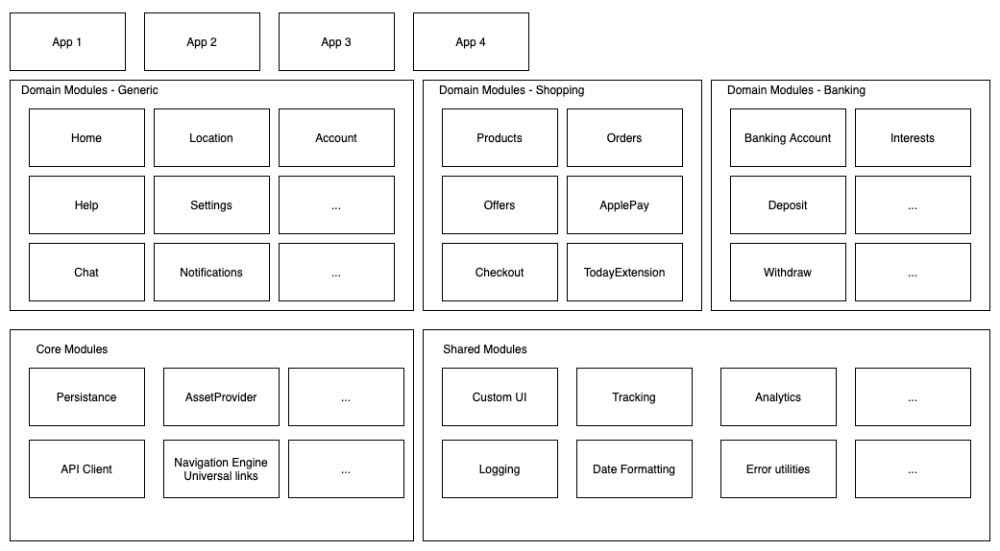

# Architecture

[ModularArchitecture.drawio](./ModularArchitecture.drawio)

### Apps

More apps can be built using our proposed modular architecture.

### Modules

- There are different groups of domain modules, depending on the application. There is a generic domain module group and there are specific domain module groups. For example one for shopping domain, one for banking domain and so on.
- Domain modules never talk to each other, they don't depend each other, they are completely isolated
- Domain module is a framework that contains Business Logic and UI, separated
- Each modules takes a Configuration as input, so that features can be enabled/disabled
- Use the Facade Pattern to expose the module interface

Build Demo Apps

Make a Proof Of Concept

Use Mono Repo

